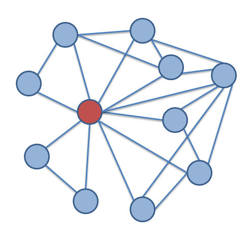

# Vínculo de portas

Seguindo a lista do modelo [12factor](http://12factor.net/pt_br), temos **“Vínculo de portas”** como sétima boa prática.

É comum encontrar aplicações que são executadas dentro de contêineres de servidores web, tal como Tomcat, ou Jboss, por exemplo. Normalmente essas aplicações são implantadas dentro desses serviços para que possam ser acessadas pelos usuários externamente.



Essa boa prática sugere que o aplicativo em questão seja auto-contido e dependa de um servidor de aplicação, tal como Jboss, Tomcat e afins. O software sozinho deve exportar um serviço HTTP e lidar com as requisições que chegar por ele. Isso quer dizer que nenhuma aplicação adicional deveria ser necessária para que seu código possa estar disponível para comunicação externa.

Tradicionalmente a implantação de aplicações em serviços de aplicação web, tal como Tomcat e Jboss, exigem que seja gerado um artefato e esse deve ser enviado para o serviço web em questão, mas no modelo de contêiner docker a idéia é que o artefato do processo de implantação seja o próprio contêiner em sí.

O processo antigo de implantação do artefato em um servidor de aplicação normalmente não tinha um retorno rápido e isso aumentava demasiadamente o processo de implantação de um serviço, pois cada alteração demandava enviar o artefato para o serviço de aplicação web, sendo que esse tinha como responsabilidade de importar, ler e executar o novo artefato.

Usando Docker facilmente torna a aplicação auto-contida. Já construímos um Dockerfile que descreve tudo que a aplicação precisa:

```
FROM python:2.7
ADD requirements.txt requirements.txt
RUN pip install -r requirements.txt
ADD . /code
WORKDIR /code
CMD python app.py
EXPOSE 5000
```

As dependências estão descritas no arquivo requirements.txt e os dados que devem ser persistidos são geridos por um serviço externo (serviços de apoio) à aplicação.

Um outro detalhe desta boa prática é que a aplicação deve exportar o serviço através da vinculação a uma única porta. Como podemos ver no código exemplo, a porta padrão do python (5000) é iniciada, mas você pode escolher outra, caso julgue necessário. Segue o recorte do código que trata desse assunto:

```
if __name__ == "__main__":
  app.run(host="0.0.0.0", debug=True)
```

Essa porta 5000 pode ser utilizada para servir dados localmente em um ambiente de desenvolvimento ou através de um proxy reverso quando for migrada para produção, com um nome de domínio adequado a aplicação em questão.

Utilizando esse modelo de vinculação de portas torna o processo de atualização de aplicação mais fluído, uma vez que na utilização de um proxy reverso inteligente, é possível adicionar novos nós gradativamente, com a nova versão, e remover os antigos a medida que as versões atualizadas estão sendo executadas em paralelo.

Convém salientar que mesmo que o Docker permita a utilização de mais do que uma porta por contêineres, essa boa prática é enfática ao afirmar que você só deve utilizar uma porta vinculada por aplicação.
